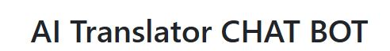
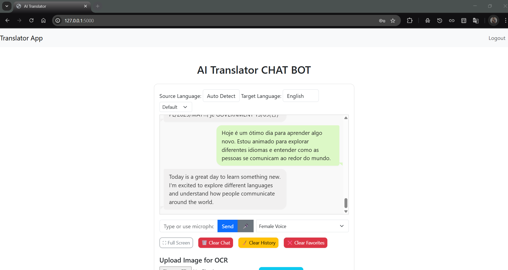
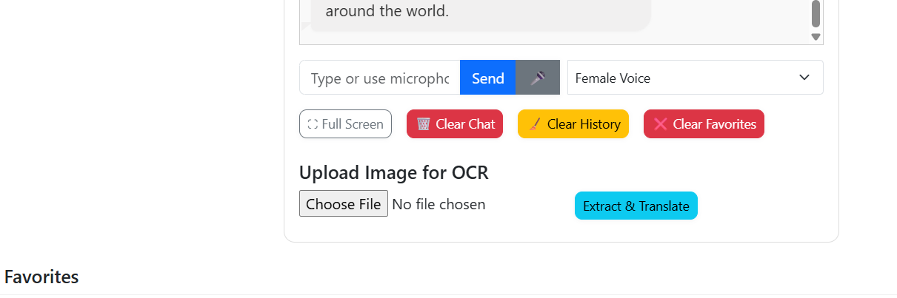
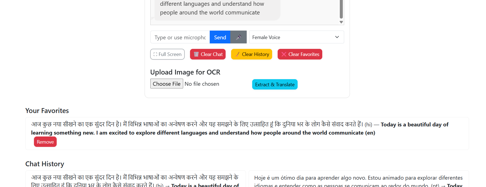
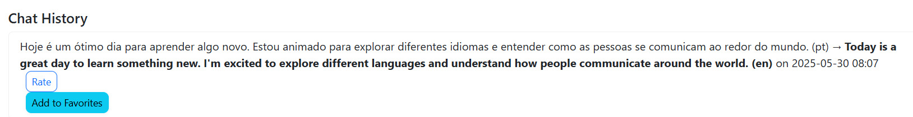

# AI Translator Chat Bot



## 🚀 Overview

**AI Translator Chat Bot** is a full-featured, modern, WhatsApp-style web app for real-time language translation, voice synthesis, OCR-powered image translation, and phrase management. Designed for ease of use and extensibility, it leverages Python (Flask), Bootstrap, gTTS, LibreTranslate, and several powerful language and image processing libraries.

---

## ✨ Features

- **Chat-style Translation:**  
  Enjoy a WhatsApp-like chat interface for seamless multilingual conversations.

- **Auto Language Detection:**  
  Automatically detects the language of your input and updates the UI accordingly.

- **Voice Synthesis (TTS):**  
  Listen to translations with selectable male/female voice (where supported).

- **Speech-to-Text:**  
  Speak your message directly via browser speech recognition.

- **OCR Image Translation:**  
  Upload images and extract text via Tesseract OCR for instant translation.

- **Favorites & Phrasebook:**  
  Save, manage, and quickly access your favorite phrases.

- **Session-based History:**  
  Review your translation history, rate quality, and provide feedback.

- **Responsive UI:**  
  Works well on all screen sizes, including mobile.

- **Full-Screen Mode:**  
  Expand the chat and controls for immersive use.

- **Pronunciation Practice:**  
  Simple feedback on how closely you pronounce the translated text.

- **User Accounts:**  
  Register, sign in, and maintain private translation histories and favorites.

---

## 📦 Tech Stack

- **Backend:** Flask, Flask-Login, SQLAlchemy, gTTS, pytesseract
- **Frontend:** Bootstrap 5, Vanilla JS, WhatsApp-style CSS
- **Translation:** LibreTranslate (self-hosted or public API)
- **OCR:** Tesseract OCR (via Pillow & pytesseract)
- **TTS:** Google Text-to-Speech (gTTS)

---

## 🖥️ Screenshots







---

## 🛠️ Installation & Running

### **Method 1: Traditional (Recommended for Most Users)**

#### 1. Clone the repository

```bash
+ git clone https://github.com/yourusername/PINNACLE.git
+ cd "PINNACLE/Ai Translator Web App/Ai Translator App"
```

#### 2. Set up Python environment

```bash
python3 -m venv venv
source venv/bin/activate  # On Windows: venv\Scripts\activate
pip install -r requirements.txt
```

#### 3. Install Tesseract OCR

- **Linux (Debian/Ubuntu):**  
  `sudo apt-get install tesseract-ocr`
- **macOS (with Homebrew):**  
  `brew install tesseract`
- **Windows:**  
  Download from [UB Mannheim builds](https://github.com/tesseract-ocr/tesseract/wiki) and update the path in `app.py` if needed.

#### 4. Set up LibreTranslate

- **Option 1:** Self-hosted (recommended):  
  Follow instructions at [LibreTranslate Deploy](https://github.com/LibreTranslate/LibreTranslate)
- **Option 2:** Use the public endpoint (for testing):  
  Update `LIBRETRANSLATE_URL` in `app.py` to `https://libretranslate.de/translate`  
  (Note: Rate limits and privacy apply)

#### 5. Run the app

```bash
flask run
# or
python app.py
```

+ Open the app in your browser at [http://localhost:5000](http://localhost:5000).
- Register a new user and start translating!

---

### **Method 2: Docker Setup (Alternative, Only If API Not Running)**

> **⚠️ WARNING:**  
> Use this Docker method **only if you cannot or do not wish to run LibreTranslate separately as an API**.  
+ > **⚠️ Note:**  
+ > Use this Docker method only if you don't run LibreTranslate separately as an API.
> Docker will run both the Flask app and a LibreTranslate container.  
> **If you are using the public LibreTranslate API or a self-hosted API, you do NOT need Docker for this app.**

#### 1. Clone the repository

```bash
+ git clone https://github.com/yourusername/PINNACLE.git
+ cd "PINNACLE/Ai Translator Web App/Ai Translator App"
```

#### 2. Build and Run with Docker Compose

Make sure you have [Docker](https://docs.docker.com/get-docker/) and [Docker Compose](https://docs.docker.com/compose/install/) installed.

- Ensure your `docker-compose.yml` looks similar to:

    ```yaml
    version: "3"
    services:
      app:
        build: .
        container_name: ai-translator-app
        ports:
          - "5000:5000"
        volumes:
          - ./instance:/app/instance
          - ./uploads:/app/uploads
        environment:
          - FLASK_ENV=development
          - LIBRETRANSLATE_URL=http://libretranslate:5001/translate
        depends_on:
          - libretranslate
      libretranslate:
        image: libretranslate/libretranslate:latest
        container_name: libretranslate
        ports:
          - "5001:5001"
        environment:
          - LT_PORT=5001
    ```

- Build and run everything:

    ```bash
    docker compose up --build
    ```
    or
    ```bash
    docker-compose up --build
    ```

- The app will be available at [http://localhost:5000](http://localhost:5000)

#### 3. (Optional) Dockerfile Example

If needed, use the following `Dockerfile` for your Flask app:

```dockerfile
FROM python:3.11-slim

WORKDIR /app

RUN apt-get update && \
    apt-get install -y tesseract-ocr libglib2.0-0 libsm6 libxext6 libxrender-dev && \
    rm -rf /var/lib/apt/lists/*

COPY requirements.txt .
RUN pip install --upgrade pip
RUN pip install -r requirements.txt

COPY . .

EXPOSE 5000

CMD ["python", "app.py"]
```

---
**Main thing, if you use locally do docker container local setup docker runner code (fully ignore method 2 and do this carefully)**


`PS C:\Internship\Pinnacle\github\PINNACLE-main\Ai Translator App> [your own directory] `
..
```
docker run -it --rm -p 5000:5000 -v libretranslate-data:/home/libretranslate/.local/share/argos-translate --user root libretranslate/libretranslate --debug --host 0.0.0.0
```

**The --rm flag means the container will be removed automatically once it stops. To keep the container, run:**

**
```
docker run -it --name libretranslate -p 5000:5000 -v libretranslate-data:/home/libretranslate/.local/share/argos-translate --user root libretranslate/libretranslate --debug --host 0.0.0.0
```

**after completing downloaded all models play the docker container / docker start -ai libretranslate
after this run only**

```
python app.py
```
**done **


CMD ["python", "app.py"]


## 📄 Usage Tips

- **Auto Detect Language:**  
  Select "Auto Detect" as source; detected language updates automatically after translation.
- **Favorites:**  
  Click "Add to Favorites" in chat history to save useful translations.
- **Speech Input:**  
  Click the 🎤 icon to dictate your message.
- **Full Screen:**  
  Use the ⛶ button for distraction-free translation.
- **OCR:**  
  Upload an image (e.g., sign, page, or screenshot) to extract and translate printed text.

---

## 🔐 Security & Privacy

- User sessions and data are stored locally (SQLite by default).
- For production:  
  - Change `SECRET_KEY` and consider a more robust DB (e.g., PostgreSQL).
  - Use HTTPS and secure deployment practices.
- Uploaded images are deleted after OCR.

---

## 🤝 Contribution

Pull requests are welcome! Please fork the repository and submit your PR.  
For major changes, open an issue first to discuss what you would like to change.

### TODO / Ideas

- Advanced TTS engine support (with real male/female voice selection)
- Support for more translation providers
- Export/import favorites/history
- Group chat or shareable links
- Language proficiency analytics

---

## 🧩 Project Structure

```
ai-translator-chatbot/
│
├── app.py
├── models.py
├── requirements.txt
├── Dockerfile
├── docker-compose.yml
├── static/
│   ├── style.css
│   ├── main.js
│   ├── smart-buttons.css
│   └── whatsapp-chat.css
├── templates/
│   ├── base.html
│   └── index.html
├── assets/
│   └── (screenshots, banner)
├── uploads/
└── instance/
```

---

## 💬 License and Credits

- MIT License
- Powered by [LibreTranslate](https://libretranslate.com/), [gTTS](https://pypi.org/project/gTTS/), [pytesseract](https://pypi.org/project/pytesseract/), and [Bootstrap](https://getbootstrap.com/).

---

## 📧 Contact

For support, suggestions, or questions, open an issue or contact [archisman04](mailto:your@email.com).

---

**Enjoy translating like never before! 🌐🗣️📸**
